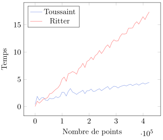

La détection de collision entre objets est un problème récurrent dans les  jeux vidéos. En 2D une comparaison de chaque pixels formant l'objet à détecter devient très couteux en termes de performance dès lors que le nombre de pixels croît ou que le nombre de collisions à détecter augmente.

Une autre approche consiste donc à utiliser une forme simple couvrant l'objet, qui permettra une détection plus efficace. 
Une des formes les plus simples de détection de collision est une collision entre deux cercles. En effet, il suffit de vérifier que la distance entre le centre des deux cercles soit inférieure à la somme de leur rayon pour détecter la collision. De même, le rectangle est un conteneur permettant la détection de collision en temps constant.
Ces formes simples nous permettent d'obtenir des détections de collision  approximatives mais avec de bonnes performances.
Le polygone convexe est un meilleur conteneur dans le sens où il permet de couvrir l'objet de façon plus précise mais la détection de collision est plus complexe. En effet si nous avons deux polygones avec respectivement $m$ et $n$ cotés, alors la détection de collision entre ces deux polygones s'exécute en $O(m\times n)$

Notre problématique est d'analyser la qualité de conteneurs d'un ensemble de points $\mathcal{P}$ dans le plan.
Dans cet objectif, nous étudierons 2 algorithmes distincts :
- Toussaint via la détermination d'un rectangle d'aire minimum couvrant $\mathcal{P}$
- Ritter via la détermination d'un cercle d'aire minimum couvrant $\mathcal{P}$

## Algorithme Toussaint
L'algorithme Toussaint permet d'obtenir un rectangle d'aire minimum contenant un ensemble de points.

**Propriété : Le rectangle minimum contenant un ensemble de points a un coté parallèle avec l'un des côtés de l'enveloppe convexe de ces points.**

Cet algorithme se décompose en 7 grandes étapes :
1. Trouver les points $P_i$, $P_j$, $P_k$, $P_l$ de l'enveloppe convexe d'abscisse minimum, d'ordonnée minimum, d'abscisse maximum, et d'ordonnée maximum 
2. Construire les 4 droites $\Delta_i$, $\Delta_j$, $\Delta_k$, $\Delta_l$ passant respectivement par $P_i$, $P_j$, $P_k$, $P_l$ 
3. Trouver l'angle minimum $\alpha$ formé par une droite $\Delta$ et un côté de l'enveloppe convexe 
4. Effectuer une rotation d'angle $\alpha$ des 4 droites  
5. Créer le rectangle formé par l'intersection des droites 
6. Calculer l'aire du rectangle et mettre à jour le rectangle minimum si besoin 
7. Calculer les nouveaux angles après rotation et répéter les étapes 3-6 pour tous les côtés de l'enveloppe convexe

### Complexité

**Etape 0** : Nous obtenons l'enveloppe convexe en appliquant l'algorithme Graham sur l'ensemble des points en $O(n)$. Cet algorithme nécessite un pré-calcul, appelé _trie pixel_ dans lequel nous parcourons une fois l'ensemble de points. De plus nous parcourons chaque triplet de points successifs pour déterminer l'enveloppe convexe.  
Complexité : $O(n+n) \rightarrow O(n)$

**Etape 1** : L'obtention des points d'abscisse minimum et maximum se fait en $O(n)$. De même pour les points d'ordonnée minimum et maximum.

**Etapes 2, 3, 4, 5, 6** : Ici nous avons affaire à de simples constructions effectuées en temps constant.

**Etape 7** : Les opérations sont répétées pour chaque côté de l'enveloppe convexe -- dans le pire cas nous avons $n$ cotés.
Complexité : $O(n)$

L'algorithme Toussaint possède donc une complexité de $O(n+n) \rightarrow O(n)$.

### Représentation et intersection de deux droites dans le plan

Nous définissons une droite par un point et un vecteur directeur.

Soit une droite $\Delta_1$ définie par un point $P$ et un vecteur $\overrightarrow{u}$.
Soit une seconde droite $\Delta_2$ définie par un point $Q$ et un vecteur $\overrightarrow{v}$.

Les deux lignes se coupent si nous pouvons trouver un point tel que : $P +t\overrightarrow{u} = Q +z\overrightarrow{v}$

Equation de t :

$$
P +t\overrightarrow{u} = Q +z\overrightarrow{v} \Leftrightarrow
(P +t\overrightarrow{u})\overrightarrow{v} = (Q +z\overrightarrow{v})\overrightarrow{v}
$$

Comme  $\overrightarrow{v} \times \overrightarrow{v} = 0$
$$
t(\overrightarrow{u} \times \overrightarrow{v}) = (Q-P) \times \overrightarrow{v}
$$

Ainsi nous avons 
$$
\boxed{t = \dfrac{(Q-P) \times \overrightarrow{v}}{ (\overrightarrow{u} \times \overrightarrow{v})}}
$$

et le point d'intersection est 
$$
\boxed{P +t\overrightarrow{u}}
$$

Source: [stackoverflow](http://stackoverflow.com/questions/563198/how-do-you-detect-where-two-line-segments-intersect)

### Calculer l'aire du polygone
Les coordonnées $(x_1, y_1), (x_2, y_2), (x_3, y_3), ..., (x_n, y_n)$ du polygone convexe sont rangées dans le déterminant ci dessous.

$$
	Aire = \frac{1}{2}
	\begin{vmatrix}
		x_1 & y_1\\
		x_2 & y_2\\
		x_3 & y_3\\
		\vdots & \vdots \\
		x_n & y_n\\
		x_1 & y_1\\
	\end{vmatrix}
	= \frac{1}{2}[(x_1  y_2 + x_2  y_3 + x_3  y_4 + \ldots + x_n y_1 ) - (y_1 x_2 + y_2 x_3 + y_3 x_4 +\ldots+y_n x_1)]
$$

<!-- [Source](http://www.mathwords.com/a/area_convex_polygon.htm) -->

### Rotation de droite

Dans notre implémentation, les droites sont représentées par un point et un vecteur directeur. La rotation d'une droite affecte la direction de son vecteur directeur. On applique donc la formule de rotations vectorielles définie ci dessous :

$$
\left( 
\begin{array}{c} 
  x' \\
  y' \\
\end{array}
\right)
=
\left( 
\begin{array}{cc} 
  \cos\theta & -\sin \theta \\
  \sin \theta & \cos \theta \\
\end{array}
\right)
\left( 
\begin{array}{c} 
  x \\
  y \\
\end{array}
\right)
$$

Ainsi on obtient : 

$$
\begin{aligned}
x' &= x \cos \theta - y \sin  \theta\\
y' &= x \sin \theta + y \cos \theta
\end{aligned}
$$

**Une petite remarque**, lors de l'implémentation de l'algorithme Toussaint, il est arrivé que l'on ait à effectuer une rotation d'une droite d'un angle très petit ( inférieur à $10^{-12}$) Dans ce cas là on considère que l'angle vaut 0.

Source: [wikipedia](https://en.wikipedia.org/wiki/Rotation_(mathematics))

## Algorithme Ritter

L'algorithme Ritter permet d'obtenir un cercle d'aire minimum contenant un ensemble de points.

1. Prendre un point dummy quelconque appartenant a l’ensemble de points de départ
2. Parcourir l’ensemble de points pour trouver un point $P$ de distance maximum au point dummy
3. Re-parcourir l’ensemble de points pour trouver un point $Q$ de distance maximum au point $P$
4. Considérer le point $c$ le centre du segment $PQ$
5. Considérer le cercle centré en $C$, de rayon $|CP|$ : il passe par $P$ et $Q$
6. Re-parcourir l’ensemble de points et enlever tout point contenu dans le cercle considéré
7. S’il reste des points dans l’ensemble de points, considérer un tel point, appelé $S$
8. Tracer la droite passant par $S$ et $C$. Celle-ci coupe le périmètre du cercle courant en deux points : soit $T$ le point le plus éloigné de $S$.
9. Considérer le point $C'$, le centre du segment ST
10. Considérer le cercle centré en $C'$ , de rayon $|C' S|$ : il passe par $S$ et $T$
11. Répéter l'étape 6-10 jusqu'à ce qu'il ne reste plus de point dans la liste

### Coordonnées du point C'

On obtient le point C' via les coordonnées barycentriques tel que : $C' = \alpha C + \beta S$ 
avec 
$$
\alpha = \dfrac{|C'S|}{|CS|} \;\;\; \beta = \dfrac{|CC'|}{|CS|}
$$
et
$$
\begin{aligned}
|C'S| &= \frac{r+|CS|}{2}\\
| CC' | &= | CS | - | C'S |
\end{aligned}
$$

### Complexité

Les étapes 1, 4, 5, 7, 8, 9 et 10 sont effectuées en temps constant → $O(1)$. On parcourt aux étapes 2, 3 et 6 tous les points → $O(n)$
Enfin à l'étape 11 on répète 6-10 un nombre limité de fois $a$ → complexité totale $O(an)$

L'algorithme Ritter possède donc une complexité de $O(n+n+an)\rightarrow O(an)$.

## Benchmark

Intéressons-nous à l'évolution du temps d'exécution de chacun des algorithmes en fonction du nombre de points. Nous faisons croitre ce nombre de 256 à 425984.

On voit clairement que le temps d'exécution des algorithmes Toussaint et Ritter augmente de façon linéaire en fonction du nombre de points. On note également un coefficient directeur de droite plus élevé pour le second ce qui, somme toute, confirme leur complexité théorique respective de $O(n)$ et $O(an)$

## Qualité des conteneurs obtenus

Notre base de test contient 1664 instances de tests contenant chacune 256 points dans un plan 2D. Pour chaque instance on s'intéresse à la qualité du conteneur selon la formule :

$$
qualite = \frac{aireConteneur}{airePolygone}-100\%
$$

Plus la valeur obtenue est petite, plus l'aire du conteneur est proche de celle de l'enveloppe convexe -- et donc la valeur la plus petite est la meilleure.

On constate que Ritter est très légèrement meilleur que Toussaint sur la majorité des instances. La qualité moyenne obtenue par l'algorithme Toussaint est de $0,25$ ce qui indique un rectangle d'aire en moyenne $25\%$ plus grande que celle de l'enveloppe convexe. L'algorithme Ritter, lui, nous donne une moyenne de $0,20$ → aire du cercle en moyenne $20\%$ plus grande que celle de l'enveloppe convexe.

Aussi, il est bon de remarquer l'écart entre la valeur minimum $0,07$ et maximum $0,50$ du cercle Ritter. Cela s'explique par la forme du polygone.

<figure>
  

    <figure>
      
      <figcaption>(a) Toussaint meilleur que Ritter</figcaption>
    </figure>
    <figure>
      
      <figcaption>(b) Ritter meilleur que Toussaint</figcaption>
    </figure>
  

  <figcaption style="margin-top:-1.4em">Exemple de résultat de qualité en fonction du nuage de points</figcaption>
<figure>

Lorsque le polygone possède une hauteur très différente de sa largeur (figure a) alors le cercle Ritter perd en qualité, il possède une aire bien plus grande que celle du polygone. Dans ce cas, le rectangle obtenu avec Toussaint est meilleur en termes de qualité. À l'inverse, plus la forme du polygone tend vers celle d'un polygone régulier (figure b) et plus le cercle Ritter sera de bonne qualité, son aire sera proche de celle du polygone.

## Conclusion

Les deux algorithmes offrent des conteneurs de qualité sensiblement identiques.
Si le nombre de points est de l'ordre de $10^4$ alors on ne note pas de différence majeure en termes de temps d'exécution. Au-delà de $10^4$ points on préfèrera utiliser l'algorithme Toussaint qui aura un meilleur temps d'exécution. 

